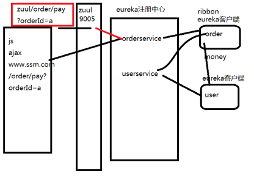
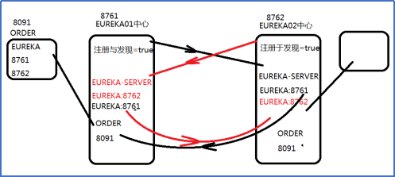

# Part1

### 服务器配置：

1. 使用 VMware workstation Pro 16 运行虚拟机
2. 使用CentOS7配置Tomcat 虚拟机，安装 jdk1.8.0、apache-tomcat-9.0.58、MySQL-server-5.6.29、MySQL-client-5.6.29。网络配置 IP 。tomcat在虚拟机的作用？
3. 修改 host 文件设置主机 localhost 别名
4. 使用 Xshell 连接虚拟机
5. 使用 sftp 如 FileZilla 上传文件

### 微服务框架（ springcloud ）：

#### 1.为什么使用：

order-and-user项目nginx与服务器、系统运行环境存在强耦合，集群针对某一系统的服务缺乏管理

#### 2.介绍：

springboot( boot 启动)依靠与springcloud。

2.1什么是微服务
当单体系统进行纵向拆分,拆分的独立系统就叫做微服务;每个微服务都专注于一个功能领域,之间通过服务调用获取,传递数据;
2.2什么是微服务框架
当微服务特别庞大的时候,就需要从管理.监控角度出发,对整个集群做到架构级别的技术整合--这种技术就成为微服务框架;
2.3微服务框架技术
常见的有spring cloud，dubbo(12年宣布停更,17年恢复更新);
spring cloud: 一种轻量级的,组件丰富全面的微服务框架技术,核心注册发现组件Eureka(不能由别人代替),实现的http的协议传输数据;组件特别丰富，所以开发投入成本较低;
dubbo: 组件没有springcloud丰富,注册发现组件可以使用Eureka(http协议),redis,zookeeper(rpc协议),使用rpc协议的技术,性能高;http性能虽然没有rpc高但是灵活度.
技术选型: spring cloud 开发成本低,所有组件是现成的直接使用,更新比较及时,对应市面的各种新技术做最新的进步;
dubbo 性能高,是dubbo重要的优点,开发成本高。

使用zuul网关进行路由过滤，结构如上图。

eureka实现高可用结构如上图。

