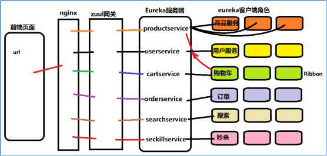
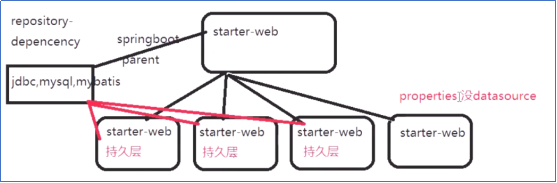
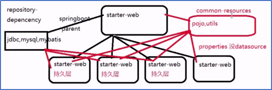
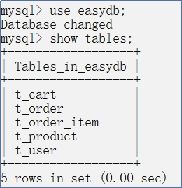
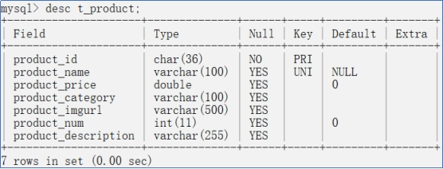
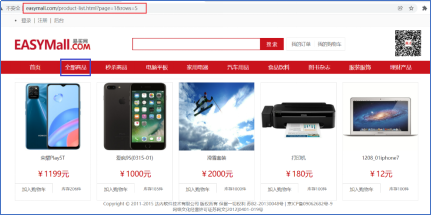
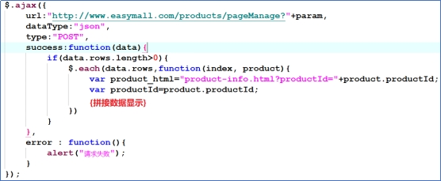
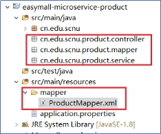

## Part2:

### 一、搭建基础工程和商城系统。

商城系统架构如上。

#### 1.父工程（easymall-parent）

搭建父工程导入相关的基础包。

#### 2.持久化简化依赖工程（easymall-common-repository）

在easymall-common-repository中创建自定义初始化属性的配置类。

Druid 的 DataSource

#### 3.工具工程（easymall-common-resources）

工具类pojo包、utils包及vo包

------

### 二、搭建商品系统（easymall-micro-product)

#### 导入数据库

#### 商品表t_product的表结构

？数据库连的是哪里的

### 创建系统功能

#### 商品分页查询

##### 1.需求展示

##### 2.js源码展示(product-list.html)

 

##### 3.js代码解释

页面通过 js 发起 ajax 请求,按照 ajax 的要求返回对象 EasyUIResult 的 json 进行解析.

###### 1.搭建代码框架结构

 

###### 2.控制器层ProductController 

接口文件：

| js请求地址 | http://www.easymall.com/products/pageManage?page=1&rows=1    |
| ---------- | :----------------------------------------------------------- |
| 后台接收   | /product/manage/pageManage?page=1&rows=1                     |
| 请求方式   | Get                                                          |
| 请求参数   | Get提交参数 Integer page,Integer rows                        |
| 返回数据   | 根据查询结果封装2个数据到EasyUIResult对象中:Integer total:查询的总条数;List<Product> rows:查询分页的数据结果; |
| 备注       | 商品总数 SELECT COUNT(*) FROM t_product分页数据(第一页的5条数据) SELECT * FROM t_product LIMIT 0,5(第二页的5条数据) select * from t_product LIMIT 5,5(第三页的5条数据) select * from t_product LIMIT 10,5 |

代码编写：

 

> `@RestController`：是一个注解，标记这个类是一个Controller组件，用于处理HTTP请求。`@RestController`是`@Controller`和`@ResponseBody`的组合，表示这个类中的方法返回的数据直接作为响应体返回。
>
> `@RestController`是Spring框架中的一个注解，它用于标识一个类是REST控制器，即用于处理HTTP请求的类。这个注解是`@Controller`和`@ResponseBody`注解的组合，提供了一种快速的方式来创建RESTful web服务。下面是对`@RestController`注解的详细解释：
>
> 1. **@Controller**：`@RestController`继承了`@Controller`注解的特性，表示这个类是一个Spring MVC控制器，用于处理HTTP请求。
> 2. **@ResponseBody**：`@RestController`还包含了`@ResponseBody`注解的功能。`@ResponseBody`注解通常用于方法级别，表示方法的返回值应该直接作为HTTP响应的正文返回，而不是返回一个视图（View）。当`@RestController`应用于类级别时，它会自动将类中所有方法的返回值作为响应体。
> 3. **自动HTTP响应体**：由于`@RestController`包含了`@ResponseBody`，它允许你直接返回对象，而不需要编写模板代码。Spring会自动将对象序列化为JSON或XML格式，并将其作为响应体发送。
> 4. **RESTful API**：`@RestController`常用于创建RESTful API。使用这个注解的类可以处理各种HTTP请求，如GET、POST、PUT、DELETE等，并且可以直接返回数据，而不是跳转到一个视图。
> 5. **方法级别的注解**：在`@RestController`注解的类中，你可以使用`@RequestMapping`或其派生注解（如`@GetMapping`、`@PostMapping`等）来映射HTTP请求到特定的处理方法。
> 6. **异常处理**：在`@RestController`类中，你可以使用`@ExceptionHandler`注解来处理控制器中抛出的异常，并将异常信息转换为合适的HTTP响应。
> 7. **请求参数绑定**：Spring MVC提供了强大的请求参数绑定功能，你可以在控制器的方法参数中使用`@RequestParam`、`@PathVariable`、`@RequestBody`等注解来自动绑定请求数据。
> 8. **依赖注入**：`@RestController`注解的类可以像其他Spring组件一样使用`@Autowired`注解进行依赖注入，以获取其他Spring管理的bean。

> `@Autowired`是Spring框架中的一个注解，用于实现自动依赖注入（Dependency Injection, DI）。Spring是一个依赖注入容器，它可以帮助开发者管理对象之间的依赖关系，而不需要手动创建对象和设置它们的依赖项。`@Autowired`注解主要用于以下几个方面：
>
> 1. **自动装配**：当你在一个类中使用`@Autowired`注解标记一个字段、构造函数或setter方法时，Spring容器在创建该类的实例时会自动寻找并注入相应的依赖项。
> 2. **类型安全**：`@Autowired`注解默认根据类型进行自动装配。这意味着Spring容器会查找与注解字段或方法参数类型匹配的bean，并将其注入。如果有多个同类型的bean，Spring会抛出一个异常，因为它不知道要注入哪一个。
> 3. **可选依赖**：可以通过设置`@Autowired`注解的`required`属性为`false`来标记一个依赖为非必须的。如果对应的bean不存在，Spring容器不会抛出异常，而是将字段设置为`null`。
> 4. **按名称装配**：除了按类型装配外，`@Autowired`注解还可以通过`@Qualifier`注解来指定bean的名称，实现按名称进行装配。这在有多个同类型bean存在时非常有用。
> 5. **构造函数装配**：使用`@Autowired`注解标记构造函数可以确保依赖项在对象构造时就被注入，这有助于保证对象在使用前总是处于完全初始化的状态。
> 6. **循环依赖**：Spring支持构造函数注入的循环依赖，但不支持setter注入的循环依赖。这意味着如果两个或多个bean相互依赖对方的setter方法，Spring容器将无法自动装配这些bean。
> 7. **作用域**：`@Autowired`注解可以与Spring的bean作用域一起使用，例如`@RequestScope`或`@SessionScope`，以控制bean的生命周期。
> 8. **元注解**：`@Autowired`注解本身也是一个元注解，它组合了`@Inject`注解和`@Target({ElementType.FIELD, ElementType.CONSTRUCTOR, ElementType.METHOD})`注解。这意味着`@Autowired`可以用于字段、构造函数和方法

###### 3.Service层ProductService

 

###### 4.Dao层ProductMapper

多个参数时,可以使用@Param注解,定义参数在sql预编译时使用

 

> `@Param`注解在Spring框架中并不是一个内置的注解，它可能是某些项目或框架中自定义的注解，用于特定的用途。然而，Spring框架中有一个与之相似的注解叫做`@RequestParam`，它用于将Web请求中的参数绑定到控制器方法的参数上。
>
> 下面是`@RequestParam`注解的一些关键点：
>
> 1. **参数绑定**：`@RequestParam`用于将HTTP请求的参数（通常是查询参数）绑定到控制器方法的参数上。
> 2. **名称和值**：使用`@RequestParam`注解的方法参数，可以通过`name`属性指定参数的名称，如果省略，则使用方法参数的名称作为参数名称。
> 3. **类型转换**：Spring会自动将请求参数的字符串值转换为方法参数的类型。这依赖于Spring的类型转换机制。
> 4. **默认值**：如果请求中没有指定参数，可以通过`defaultValue`属性指定一个默认值。
> 5. **必需性**：可以通过`required`属性指定参数是否为必需。如果设置为`false`，即使请求中没有该参数，方法也可以正常执行。
> 6. **使用场景**：`@RequestParam`通常用于GET和POST请求，用于处理查询字符串参数或表单提交的数据。

###### 5.映射文件ProductMapper.xml 

 

##### 单独测试：

> http://localhost:10001/product/manage/pageManage?page=1&rows=2

返回结果为 EasyUIResult 对象，查看结构是否对应。

##### 页面整合测试（网关工程，easymall-micro-zuul）

以上代码完成单独测试部分，接下来将内部地址转为外部地址，同时将静态资源和图片配置到nginx。

主要步骤为

1. 创建一个网关工程easymall-micro-zuu
2. 在host文件中配置www.easymall.com
3. 在Nginx中配置静态界面
4. 将easymall-static复制到d:\java\nginx-1.9.9中
5. 根据js请求地址,在nginx中做商品系统的location匹配

以下为测试过程和运行分析

> \1) 启动
>
> l 启动Eureka-Server和Eureka-Server2。查看结果
>
> l 启动网关***\*easymall-micro\*******\*-zuul\****
>
> l 启动easymall-microservice-product
>
> 查看结果
>
> \2) 运行过程分析
>
> 起始访问地址，通过js:
>
> http://www.easymall.com/products/pageManage?page=1&rows=5
>
> http://www.easymall.com/products/pageManage;
>
> ***\*http://127.0.0.1:9005/zuul-product/product/manage/pageManage?page=1&rows=5\****
>
> |nginx监听 location匹配
>
> 将www.easymall.com/products去掉
>
> 剩下/pageManage;拼接proxy_pass的路径
>
> ***\*|\****nginx拼接转发后发送的地址
>
> http://localhost:9005/zuul-product/product/manage/pageManage
>
> ***\*|\****zuul网关接收到地址
>
> ***\*|\****满足路由匹配/zuul-product/**
>
> ***\*|\****路径过滤http://localhost:9005/zuul-prod/
>
> ***\*|\****拼接底层restTemplate发起向服务的请求
>
> http://productservice/product/manage/pageManage
>
> ***\*|\****经过ribbon抓取的服务list进行正确服务节点的拼接
>
> http://localhost:10001/product/manage/pageManage

基于以上步骤实现单个商品查询功能。

#### 商品新增功能

#### 商品修改功能
