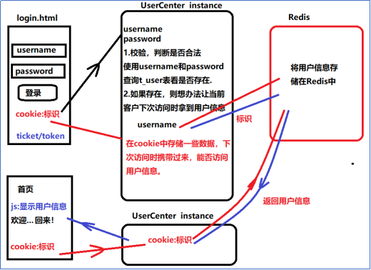
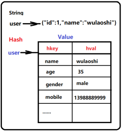
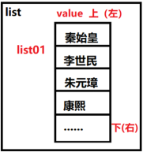
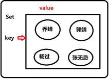
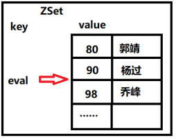

# Part4用户系统和Redis5种数据类型string、Hash、set、zset、List

easymall-microservice-user

## 主要功能：

### 用户名校验

接口文件

| js请求地址 | http://www.easymall.com/user/checkUserName                   |
| ---------- | ------------------------------------------------------------ |
| 后台接收   | /user/manage/checkUserName                                   |
| 请求方式   | Post                                                         |
| 请求参数   | String userName                                              |
| 返回数据   | 返回SysResult对象的json,其结构:Integer status; 200表示用户名不存在,可以使用,其他表示不可用String msg;成功返回 “ok”,失败返回其他信息Object data;根据需求携带其他数据 |
| 备注       | 返回200 sql返回0 select count(user_id) from t_user where user_name=#{userName},否则返回sysresult的status==其他值 |

### 注册表单提交

接口文件

| js请求地址 | http://www.easymall.com/user/save                            |
| ---------- | ------------------------------------------------------------ |
| 后台接收   | /user/manage/save                                            |
| 请求方式   | Post                                                         |
| 请求参数   | User user 缺少用户id,password需要加密                        |
| 返回数据   | 返回SysResult对象的json,其结构:Integer status; 200表示成功,其他表示失败String msg;成功返回 “ok”,失败返回其他信息Object data;根据需求携带其他数据 |

### 登录功能

# Redis

redis-3.2.11

> ## 是什么
>
> Redis 是一个支持nosql，key-value数据类型、内存、缓存、分布式的、可持久化、非关系型数据库。
>
> ## nosql,key-value非关系型数据库
>
> ### 结构化数据和非结构化数据
>
> 将一批数据的共有特性经过提取后的有结构的数据就是结构化数据(例如一个国家的所有学生信息)
>
> 不能以同一个结构描述的一个数据集合,统称为非结构化数据(网页,日志是典型的非结构化数据) 
>
> ### key-value/nosql
>
> 存储结构化数据使用二维表;
>
> 典型的关系型数据库（MySQL、Oracle）,处理的是结构化数据，使用的操作语言sql(structured query language);
>
> 存储非结构化数据使用的常用结构就是key-value;
>
> 对于非结构化的海量数据处理(增删查改),使用nosql(not only structured query language);
>
> 典型的非关系型数据库redis,mongoDB
>
> ### 可持久化
>
> 存储在redis内存中的数据,可以设置持久化策略,在断电内存数据丢失时,重启redis可以从磁盘文件重新读取数据(占据市场重要的技术点)
>
> ### 支持分布式集群
>
> 3.0之后的cluster技术,1000个节点
>
> 可以使用redis搭建传统结构的分布式,或者利用redis-cluster搭建集群
>
> ### 支持的各种功能
>
> \1. 缓存,提升系统访问数据的性能(减少了层级之间的调用)
>
> \2. 低配版本的消息队列
>
> \3. 实现各种逻辑锁
>
> \4. session共享使用redis解决
>
> ## 内存
>
> redis在运行期间,使用的是内存资源作为存储介质存储数据;具有内存的致命缺陷(容量上限有限,断电丢失数据);优点是内存存储快极了;
>
> Redis是单实例,单线程的技术。如果一个服务器中只启动一个redis的server不足以充分发挥一个服务器的性能的;所以一般在同一台服务器上,我们可以根据服务器性能多启动几个redis实例,这样一个服务器可以运行多个Redis节点，这时要保证多个节点的端口不能冲突。
>
> 

crud(create Retrieve update delete)命令：

> 2.3 测试Redis命令-nosql的增删改查命令
>
> 2.3.1.添加 set 
>
> 2.3.2.查询 get
>
> 2.3.3.修改 set
>
> 2.3.4.删除 del 
>
> 2.4 Redis的命令参数
>
> 2.4.1 EX seconds 设置过期时间，以秒为单位
>
> 2.4.2 PX milliseconds 设置过期时间，以毫秒为单位
>
> 2.4.3 NX （only not ？exist,仅不存在才set）
>
> 2.4.4 XX （仅存在才set）

## Redis五种数据类型及基本命令

### String类型

3.1.1 String类型数据结构

3.1.2命令

\1. keys *查询所有键

\1. set key value

\2. get key

\3. select 整数

\4. exists key

\5. del key

\6. type key

\7. flushall

\8. save

\9. flushdb

\10. incr decr key

\11. incrby decrby key

\12. mset 和 mget 批量操作

\13. expire key:超时设置

\14. ttl key

\15. pttl key

\16. pexpire

\17. append key value

## Hash数据类型

对应value为hash结构的数据都是面向对象的数据结构

3.2.2 命令

\1. hset key field value

key 是 相当于变量名，field是value中的key-value对中的key，面向对象时表示一个对象的属性名称， value表示属性的值

\2. hget key field

\3. hexists key field

\4.  hmset和hmget

\5. Hdel key field:

\6. Hkeys 和Hvals:

\7. Hlen key

\8. Hincrby

## 3.3 List链表数据类型

List 类型数据结构

list01--{“200”,"300","400"}

3.3.2 命令

\1. lpush key value [values]

\2. lrange key 起始下标 结束下标

\3. rpush key value

\4. linsert

\5. lset key index value对下标对应的数据修改

\6. lrem 从下往上删除

\7. ltrim 保留链表指定范围内的数据元素剩余的删除

\8. lpop 从list头部删除元素

3.3.3两个链表的数据交互

rpoplpush

## 3.4 Set结构

3.4.1 Set 类型数据结构

集合用来保存多个字符串元素，和列表不同的是不允许有重复元素，并且集合中元素是无序的。

最常见的应用场景，比如兴趣爱好，社交平台中关注人存在一个集合中，将其所有粉丝存在一个集合

3.4.2单集合操作

\1. sadd key member添加

\2.  smembers key获取所有元素

\3. srem key member删除

\4. scard key 返回元素个数

\5. sismember key element判断元素是否在集合中

\6. srandmember key 随机抽取几个元素

3.4.3集合间的操作

\1. sinter set1 set2 交集

\2. suinon set1 set2 并集

\3. sdiff set1 set2 差集属于set1不属于set2的元素为差集

## 3.5 ZSet结构（sorted set）

3.5.1 ZSet数据结构

在集合的基础上绑定一个score作为排序的依据

比较典型的使用场景是***\*排行榜系统\****。例如视频网站需要对用户上传的视频做排行榜

3.5.2单集合（单个集合内操作）

\1. zadd key score member添加成员

\2. zscore key member查看某个成员的分数

\3. 计算成员的升序排名 zrank key member

\4. 删除成员 zrem key member

\5. 增加成员的 分数zincrby key increment member

\6. 返回指定排名范围的成员 zrange key start end（-1表示最后一个）

\7. 返回指定分数范围的成员 zrangebysore key min max

\8. 返回指定分数范围成员个数 zcount key min max

\9. 删除指定排名内的升序元素 zremrangebyrank key start end

\10. 删除指定分数范围的成员 zremrangebyscore key min max

3.5.3 集合间的操作

交集 zinterstore destination numkeys key1 key2

