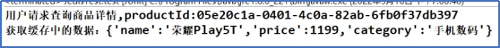

# Part5

部署多实例Redis-商品数据的缓存使用-分片连接池-登录功能整合Redis

## 部署多实例Redis

> ***\*Redis\****是***\*单实例\****,***\*单线程\****的技术。如果一个服务器中只启动一个redis的server不足以充分发挥一个服务器的性能的;所以一般在同一台服务器上,我们可以根据服务器性能多启动几个redis实例,这样一个服务器可以运行多个Redis节点，这时要保证多个节点的端口不能冲突。
>
> 为了保证多个节点端口不冲突，要修改redis配置文件。下面来搭建3个节点的redis

安装vim插件

redis.conf配置文件学习。

复制并配置了3台redis服务器的配置文件

redis01.conf 端口6379

查看启动情况。

启动节点：redis-server redis01.conf

查看节点情况：ps -ef|grep redis

到客户端登录

进行crud

停止服务可先退出客户端，在其他端口停止客户端后，查看服务进程，杀进程


测试保护模式，启动密码。redis实例启动成功后，客户端登录后，添加数据时需要授权，授权成功后，才可以进行添加数据和查看数据等操作。

## Jedis

### 服务器端：

使用时查询服务器端口号开放情况

firewall-cmd --query-port=6379/tcp

设置开放

firewall-cmd --zone=public --add-port=6379/tcp --permanentsuccess


### 创建工程springboot-redis-test01

#### 单实例连接测试

> Jedis jedis = new Jedis("localhost", 6379); // 创建连接
> jedis.auth("password"); // 如果需要，进行认证
>
> long newValue = jedis.decr("myKey"); // 将 "myKey" 的值减一
>
> long newValue = jedis.decrBy("myKey", 5); // 将 "myKey" 的值减去 5

jedis语法

#### 测试其他数据类型crud

hash:

jedis.hset("user","username","aa")

jedis.hget("user","username")

List;

jedis.flushDB（）清空数据库

jedis.lpush("list1","2","434")

rpush

linsert（）


#### 缓存


用户查询一个商品 productId=05e20c1a-0401-4c0a-82ab-6fb0f37db397

逻辑:

1）判断缓存是否存在这个商品数据

2）如果存在,读取出来.直接封装返回,不再调用持久层

3）如果不存在,调用持久层获取数据,并存储一份在redis供后续使用。

4）存储数据时,key值的设计规则:根据业务意义设计key

例如,某个商品的key="product"+productId;

某个用户的key="user_"+userId;

模拟缓存代码：

						

第一次执行结果：

 

第二次执行结果：



## 结合redis完成用户登录

点击登录发起ajax请求,将***\*用户名\****传递给后台处理,根据***\*响应结果\****判断处理,如果***\*成功\****跳转向首页.

预先Nginx配置

 location /user{
				proxy pass http://127.0.0.1:9005/zuul-user/user/manage;

}

Js请求地址：

http://www.easymall.com/user/login

Nginx转发，nginx将/user转为指定网址

[http://127.0.0.1:9005/zuul-user/user/manage/login](http://127.0.0.1:9005/zuul-user/user/manage/login )

网关路由配置：zuul微服务配置替换zuul-user网址

zuul.routes.zuul-user.path=/zuul-user/**

zuul.routes.zuul-user.serviceId=userservice

路由转发：

http://userservice/user/manage/login

ribbon抓取，根据微服务名替换服务端口

http://127.0.0.1:10003/user/manage/login


代码存在的问题：

1. 代码中使用了new,登录并发量多，导致内存溢出。  
2. 访问的redis是单机节点，节点down了，任何人都无法登录
3. 单节点，容易达到内存容量上限

## redis分片

> 单个redis的内存容量上限.很容易达到瓶颈,即使配置数据时使用超时逻辑，也会因为单机down掉导致系统无法登录。
>
> 可以利用redis的分布式集群;
>
> 分布式技术引入项目之后.要考虑一个问题.数据如何划分
>
> 在分布式结构中,如何将数据划分给不同的节点.进行分布式处理的过程—也就是数据分片的计算过程

#### hash取余算法(利用hashCode完成)

**工作原理**：

- 首先计算数据的哈希值。
- 然后使用节点的数量对哈希值进行取余操作，结果就是数据应该被分配到的节点索引。

例如，如果有 3 个节点，数据项的哈希值是 10，那么 `10 % 3 = 1`，数据项将被分配到索引为 1 的节点。

**优点**：

- 实现简单，易于理解和实现。
- 当节点数量固定时，数据分布相对均匀。

**缺点**：

- 当节点数量变化时（增加或减少节点），几乎所有数据项都需要重新分配，因为取模的结果会改变。
- 可能导致数据分布不均匀，特别是在节点数量较少时。

### ShardedJedis 和 分片连接池

#### ShardedJedis

`ShardedJedis` 是 Jedis 客户端库的一个扩展，用于支持 Redis 的分片（Sharding）。在 Redis 分片中，数据被分割成多个部分，每个部分存储在不同的 Redis 服务器上。这样做可以提高数据存储的容量和处理能力，因为负载被分散到了多个节点上。

`ShardedJedis` 允许你透明地与多个 Redis 节点交互，就像它们是一个单一的逻辑 Redis 实例一样。它内部维护了一个节点到分片的映射，当执行操作时，`ShardedJedis` 会根据数据的键来决定应该将请求发送到哪个分片。

#### 分片连接池

分片连接池是管理多个 Redis 分片连接的一种机制。在分片的 Redis 环境中，每个分片可能都需要一个或多个物理连接。连接池的作用是重用这些连接，减少创建和关闭连接的开销，同时提供高效的连接管理。

连接池通常会提供以下功能：

- **连接创建和管理**：创建一定数量的连接，并在需要时提供给客户端使用。
- **连接重用**：当客户端完成操作后，连接不会立即关闭，而是返回到连接池中，供其他客户端使用。
- **连接监控**：监控连接的状态，如空闲时间、活动状态等，以便于维护连接的健康状况。

#### ShardedJedis 和 分片连接池的关系

`ShardedJedis` 与分片连接池之间的关系是紧密的。`ShardedJedis` 负责逻辑上的数据分片，而分片连接池则负责物理上连接的管理。在使用 `ShardedJedis` 时，你可以配置一个或多个连接池，每个连接池对应一个 Redis 分片。

- 当 `ShardedJedis` 需要与某个分片交互时，它会从对应的连接池中获取一个连接。
- 操作完成后，连接会被释放回连接池，供后续操作使用。

这种设计允许 `ShardedJedis` 以高效的方式管理大量的连接，同时保持操作的透明性和简便性。使用连接池还可以提高性能，因为它减少了每次操作都需要建立新连接的开销。

#### 实际应用

在实际应用中，使用 `ShardedJedis` 和分片连接池可以这样进行：

```
ShardedJedisPool shardedPool = new ShardedJedisPool(
    new JedisPoolConfig(), // 配置连接池参数
    shards // 分片信息，包括主机和端口
);

ShardedJedis shardedJedis = shardedPool.getResource();

// 使用 shardedJedis 执行操作，例如获取一个键的值
String value = shardedJedis.get("myKey");

shardedJedis.close(); // 操作完成后，释放资源
```

在这个例子中，`ShardedJedisPool` 是分片连接池的实现，它负责管理所有分片的连接。当获取 `ShardedJedis` 实例时，实际上是从连接池中获取了资源，以便进行 Redis 操作。操作完成后，资源被释放回连接池。

## 使用分片连接池改进用户登录

有了分片连接池,可以高效的使用多个redis节点的集群完成redis功能操作

在user项目配置SharedJedisPoolConfig配置类

修改service.

定义 ShardedJedisPool pool属性。

ShardedJedis jedis = pool.getResource();

jedis.set(ticket, userJson)

userJson = jedis.get(ticket)