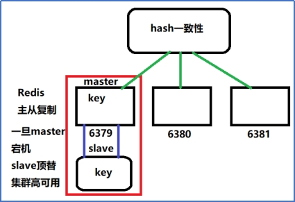
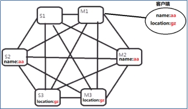
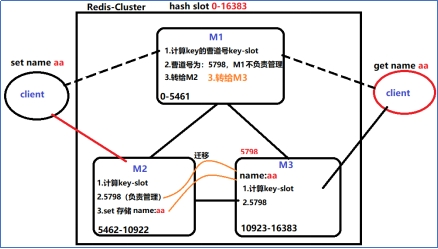
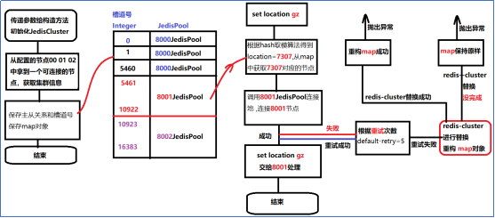

# Part6:Redis高可用 搭建Redis集群 JedisCluster操作集群

## Redis分布式集群的结构

 

实现集群节点的高可用,支持数据的备份功能是高可用的基础;

## 1.redis的主从复制

redis支持数据的主从复制,支持多级主从,一主多从的复制结构,当结构过于复杂时,数据同步的效率就降低了.企业经验,最多2级主从（父、子、孙）,最多一个主6个从节点;

## 2.哨兵集群模式(sentinel)

2.1介绍和原理

redis-cluster(Redis3.0)出现之前,绝大部分的redis的使用是围绕哨兵集群展开的;利用单独的进程(特殊redis-server),开启对主从结构的监听;监听主节点,先从主节点调用命令info replication,拿到主从结构的所有信息,保存在内存中,后续每1秒钟发起一次心跳检测(rpc远程通信协议),一旦发现主节点宕机,哨兵集群发起投票选举,最终过半的票数确定事件的结果;

2.2哨兵集群结构 

一个哨兵集群,只能维护一个数据分片的高可用结构,不能完成分布式的结构;

分布式结构如下:

 

客户端连接的是哨兵，从哨兵那里知道那个节点正在提供服务。

2.3哨兵集群的投票机制

为什么要投票?为什么过半?

哨兵监听的主从关系.是状态 ,每一次角色的变化,都由哨兵来监控--对所有的主从结构的决策都需要投票.

哨兵节点需要连接主从结构(涉及到网络通信),只有一个哨兵节点的管理结构,不可信，只有一个哨兵节点，当哨兵连接主从结构的网络异常时，会误判为主从结构的节点出问题。

所以必须引入哨兵集群，管理主从结构.毕竟超过一半的节点都误判了的几率极小;

集群容忍度(宕机容忍度)

哨兵集群容忍度:可以允许宕机的个数,就是集群的容忍度;

5个哨兵集群节点:为了达到过半选举至少3个节点;容忍度是2

6个哨兵集群节点:为了过半至少剩余4个节点,容忍度是2

2n-1个集群的容忍度和2n是一样的;一般过半机制的集群,选择都是奇数个;

------

项目使用的是redis-cluster

## 3.Redis Cluster

1.介绍

Redis3.0版本出现的一个新的redis集群结构,引入了很多新的概念和逻辑.将之前学习的主从复制.哨兵监听的逻辑整合到了这个新的结构当中.

2.redis-cluster的集群结构

slave master 

2.1集群结构中的特性和功能

集群节点两两互联,底层依赖二进制传输协议的,优化传输速度，内部之间传输很快.(集群的基础)

集群的监控监听机制,交给主节点投票(哨兵集成到了集群的主节点中),任意的主节点宕机,只要剩下的主节点满足过半.

客户端连接任意一个节点,都可以向集群传递命令存储和获取数据,数据会在集群内部做节点的连接跳转.

引入了新的分布式分片计算逻辑--hash取模(取余,CRC16()散列计算);取模结果[0,..16383],这个范围区间,称之为槽道号--hash slot，每个master负责管理一批槽道号，由于槽道的存在,key值做hash取模运算,根据key的取模结果判断是否归哪个节点管理,从而做到了解耦,key和节点的解耦key--slot--node.

2.2 Redis集群计算Key的算法

Redis集群计算Key的算法

https://segmentfault.com/a/1190000018094567?utm_source=tag-newest

Key=CRC16(name)%16384=5798  所以key的范围0-16383

Key= CRC16(location)%16384=7307

Redis之间进行数据交换的时候消息头所占空间为CLUSTER_SLOTS/8，

也就是16384÷8÷1024=2kb

2.3槽道管理的逻辑

Redis Cluster要求一个集群最少需要3个主节点(最少的集群容忍度1,3个才能容忍宕一个),由于槽道的限制,理论上最多16384(官方版本提示1000节点左右)

 

每一个主节点都可以具备槽道管理权,也可以不具备槽道管理权(只具备投票权利)

2.4槽道原理需要了解解决的问题

计算CRC16()%16384,得到的整数，如何判断是否为当前节点的管理范围?

如果不是当前节点管理的槽道范围,如何知道正确的槽道管理者是谁?

使用ruby语言搭建Redis集群

接下来主要进行了几场测试。

1. 在服务器上搭建集群简单的增删改关节点
2. 理论分析槽道计算key过程、
3. 测试槽道划分、
4. springboot整合JedisCluster操作集群

